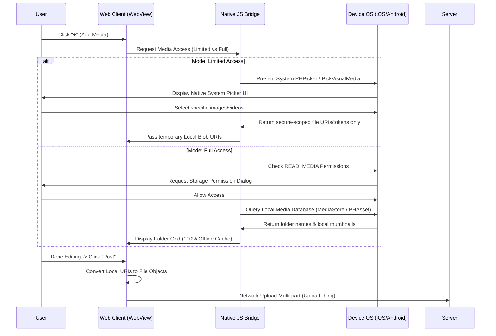

# Native Gallery Permissions & Media Picker Specification

This document details the architectural layout, system permission manifest configurations, and native source code examples required to implement secure photo pickers and offline local media indexes for **iOS** and **Android**, matching the specifications of YouTube and Instagram.

---

## Core System Architecture Flow



---

## 1. iOS Implementation (Swift & CocoaTouch)

iOS 14+ introduces `PHPickerViewController`, which runs in an isolated process. The calling application does not need to ask for full photo library access to retrieve user-selected files.

### 1.1 Info.plist Permissions Config

Add the following description tags to the app's `Info.plist`:

```xml
<!-- Required for querying local albums & folders (Full Access) -->
<key>NSPhotoLibraryUsageDescription</key>
<string>Next Social needs read-only access to display folders, albums, and dates in the media editor.</string>

<!-- Required if saving processed clips back to the device -->
<key>NSPhotoLibraryAddUsageDescription</key>
<string>Next Social needs permission to save edited short clips to your photos library.</string>
```

### 1.2 Swift: Limited Access Picker (`PHPickerViewController`)

```swift
import PhotosUI
import MobileCoreServices
import UniformTypeIdentifiers

class MediaPickerHelper: NSObject, PHPickerViewControllerDelegate {
    weak var viewController: UIViewController?
    var onSelectionComplete: (([URL]) -> Void)?

    func presentPicker(limit: Int = 10) {
        guard let vc = viewController else { return }
        var config = PHPickerConfiguration(photoLibrary: .shared())
        config.filter = .any(of: [.images, .videos])
        config.selectionLimit = limit
        
        let picker = PHPickerViewController(configuration: config)
        picker.delegate = self
        vc.present(picker, animated: true)
    }

    func picker(_ picker: PHPickerViewController, didFinishPicking results: [PHPickerResult]) {
        picker.dismiss(animated: true)
        
        var selectedUrls: [URL] = []
        let group = DispatchGroup()
        
        for result in results {
            let provider = result.itemProvider
            if provider.hasItemConformingToTypeIdentifier(UTType.movie.identifier) {
                group.enter()
                provider.loadFileRepresentation(forTypeIdentifier: UTType.movie.identifier) { tempUrl, error in
                    defer { group.leave() }
                    guard let localUrl = tempUrl else { return }
                    
                    // Securely copy the temporary URL to the app's sandboxed local cache
                    let destinationUrl = FileManager.default.temporaryDirectory
                        .appendingPathComponent(UUID().uuidString)
                        .appendingPathExtension(localUrl.pathExtension)
                    
                    do {
                        try FileManager.default.copyItem(at: localUrl, to: destinationUrl)
                        selectedUrls.append(destinationUrl)
                    } catch {
                        print("File caching failed: \(error)")
                    }
                }
            }
        }
        
        group.notify(queue: .main) {
            self.onSelectionComplete?(selectedUrls)
        }
    }
}
```

### 1.3 Swift: Full Access Local Queries (`PHAsset` & `PHImageManager`)

If Full Access is granted, load directory indices locally:

```swift
import Photos

func fetchLocalAlbumsIndex() -> [[String: Any]] {
    var albumsList: [[String: Any]] = []
    
    // Fetch smart albums (Camera Roll, Favorites, etc.)
    let smartAlbums = PHAssetCollection.fetchAssetCollections(with: .smartAlbum, subtype: .any, options: nil)
    smartAlbums.enumerateObjects { collection, _, _ in
        let fetchOptions = PHFetchOptions()
        fetchOptions.predicate = NSPredicate(format: "mediaType == %d OR mediaType == %d", 
                                            PHAssetMediaType.image.rawValue, 
                                            PHAssetMediaType.video.rawValue)
        let assets = PHAsset.fetchAssets(in: collection, options: fetchOptions)
        if assets.count > 0 {
            albumsList.append([
                "title": collection.localizedTitle ?? "Folder",
                "count": assets.count,
                "collection": collection
            ])
        }
    }
    return albumsList
}
```

---

## 2. Android Implementation (Kotlin & Jetpack)

On Android 13+ (API 33+), the `PickVisualMedia` API leverages a secure system picker process. No broad storage permissions (`READ_MEDIA_IMAGES` / `READ_MEDIA_VIDEO`) are declared in the manifest.

### 2.1 AndroidManifest.xml Config

```xml
<manifest xmlns:android="http://schemas.android.com/apk/res/android">

    <!-- Querying MediaStore directly (For Android 12 and below) -->
    <uses-permission android:name="android.permission.READ_EXTERNAL_STORAGE" android:maxSdkVersion="32" />
    
    <!-- Querying MediaStore directly (For Android 13+) -->
    <uses-permission android:name="android.permission.READ_MEDIA_IMAGES" />
    <uses-permission android:name="android.permission.READ_MEDIA_VIDEO" />

</manifest>
```

### 2.2 Kotlin: Limited Access Picker (`PickVisualMedia` API)

```kotlin
import androidx.activity.result.contract.ActivityResultContracts
import androidx.activity.result.PickVisualMediaRequest
import android.content.Intent
import android.net.Uri

class AndroidPickerHelper(private val activity: ComponentActivity) {

    // Registers system photo picker activity launcher
    private val pickMultipleMedia = activity.registerForActivityResult(
        ActivityResultContracts.PickMultipleVisualMedia(10)
    ) { uris: List<Uri> ->
        if (uris.isNotEmpty()) {
            val localUris = mutableListOf<String>()
            for (uri in uris) {
                // Persist read access permissions for WebViews / local caching
                activity.contentResolver.takePersistableUriPermission(
                    uri,
                    Intent.FLAG_GRANT_READ_URI_PERMISSION
                )
                localUris.add(uri.toString())
            }
            // Send secure local string URIs back to Web Clients / WebView interface
            triggerWebUIUploadCallback(localUris)
        }
    }

    fun launchSystemPicker() {
        pickMultipleMedia.launch(
            PickVisualMediaRequest(ActivityResultContracts.PickVisualMedia.ImageAndVideo)
        )
    }
}
```

### 2.3 Kotlin: Full Access MediaStore Directory Queries

Query local folders using SQL-like cursors on the ContentResolver database:

```kotlin
import android.provider.MediaStore
import android.content.ContentUris
import android.database.Cursor

fun getLocalFolderBuckets(context: Context): List<Map<String, Any>> {
    val folders = mutableListOf<Map<String, Any>>()
    val uri = MediaStore.Files.getContentUri("external")
    
    val projection = arrayOf(
        MediaStore.Files.FileColumns.BUCKET_DISPLAY_NAME,
        MediaStore.Files.FileColumns.BUCKET_ID
    )
    
    val selection = ("(${MediaStore.Files.FileColumns.MEDIA_TYPE}=? OR ${MediaStore.Files.FileColumns.MEDIA_TYPE}=?)")
    val selectionArgs = arrayOf(
        MediaStore.Files.FileColumns.MEDIA_TYPE_IMAGE.toString(),
        MediaStore.Files.FileColumns.MEDIA_TYPE_VIDEO.toString()
    )
    
    val sortOrder = "${MediaStore.Files.FileColumns.DATE_ADDED} DESC"
    
    context.contentResolver.query(uri, projection, selection, selectionArgs, sortOrder)?.use { cursor ->
        val bucketNameCol = cursor.getColumnIndexOrThrow(MediaStore.Files.FileColumns.BUCKET_DISPLAY_NAME)
        val bucketIdCol = cursor.getColumnIndexOrThrow(MediaStore.Files.FileColumns.BUCKET_ID)
        
        val visitedIds = HashSet<String>()
        while (cursor.moveToNext()) {
            val id = cursor.getString(bucketIdCol)
            val name = cursor.getString(bucketNameCol) ?: "Local Folder"
            if (!visitedIds.contains(id)) {
                visitedIds.add(id)
                folders.add(mapOf("id" to id, "name" to name))
            }
        }
    }
    return folders
}
```

---

## 3. Cross-Platform Configurations (React Native & Flutter)

### 3.1 Expo / React Native

Use Expo Image Picker, which encapsulates native system pickers on iOS and Android:

```typescript
import * as ImagePicker from 'expo-image-picker';

async function launchExpoPicker() {
  // Limited Access: Uses PHPickerViewController / PickVisualMedia automatically
  const result = await ImagePicker.launchImageLibraryAsync({
    mediaTypes: ImagePicker.MediaTypeOptions.All,
    allowsMultipleSelection: true,
    selectionLimit: 10,
    quality: 1,
  });

  if (!result.canceled) {
    // Assets are local URI string tokens (file:// or content://)
    const localUris = result.assets.map(asset => asset.uri);
    console.log("Local assets ready for deferment: ", localUris);
  }
}
```

### 3.2 Flutter

Use `photo_manager` for Full Access local index queries, and `image_picker` for native OS system photo pickers:

```dart
import 'package:image_picker/image_picker.dart';

final ImagePicker _picker = ImagePicker();

Future<void> pickMediaFromOS() async {
  // Triggers OS Native Photo Picker on iOS/Android
  final List<XFile> medias = await _picker.pickMultipleMedia();
  
  if (medias.isNotEmpty) {
    for (var file in medias) {
      // Local file reference (no upload occurs yet)
      print("Local URI: ${file.path}");
    }
  }
}
```
